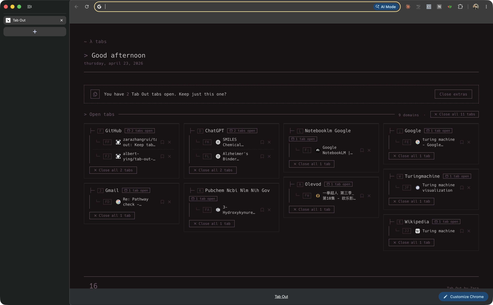

# tab-out-tree

**A terminal-tree new tab page, driven from the home row.**

A personal fork of [**tab-out**](https://github.com/zarazhangrui/tab-out) reskinned in the style of [**StartTree**](https://github.com/Paul-Houser/StartTree) and rewired for keyboard-first navigation. Live tab dashboard underneath — `tree`-command aesthetic on top.

<p align="center">
  
</p>

No server. No account. No external calls. Just a Chrome extension.

---

## What it does

- Replaces your new tab page with a dashboard of everything you have open, grouped by domain
- Every tab gets a **home-row hint letter** (`f`, `j`, `d`, `k`, `l`, `a`, `;`, `w`, `e`) — type it to jump
- **Shift + hint** closes the tab instead of jumping
- Prefixes: `s<hint>` save for later, `g<hint>` jump to group
- `/` focus search · `r` reload list · `?` help · `Esc` reset
- Palette is live from [pywal](https://github.com/dylanaraps/pywal) — re-sync by copying values from `~/.cache/wal/colors.json` into the `:root` block of `extension/style.css`
- Bundled [Hack](https://sourcefoundry.org/hack/) monospace font; no web-font fetch

---

## Install

1. Clone this repo
   ```bash
   git clone https://github.com/albert-ying/tab-out-tree.git
   ```
2. Open `chrome://extensions`, toggle **Developer mode** on
3. Click **Load unpacked** and pick the `extension/` folder
4. Open a new tab

---

## Keyboard reference

| Keys            | Action                              |
|-----------------|-------------------------------------|
| `<hint>`        | jump to that tab                    |
| `Shift+<hint>`  | close that tab                      |
| `g<hint>`       | jump to first tab in a group        |
| `s<hint>`       | save tab for later                  |
| `c`             | classify tabs with Claude (bridge)  |
| `/`             | focus archive search                |
| `r`             | reload tab list                     |
| `?`             | toggle help overlay                 |
| `Esc`           | reset / close help                  |

Hints auto-regenerate whenever tabs open or close.

---

## Classification with Claude (optional)

Press `c` on the new tab page and Claude classifies your open tabs into
3–6 cross-domain semantic groups ("longevity research", "faculty search",
"shopping", ...), rendered as a second row of cards above the domain
grouping.

It relies on a small localhost bridge that wraps `claude -p` and uses
your existing Claude Code auth (Max subscription if you have one — no
separate API key).

```bash
# one-off
node bridge/claude-bridge.js

# or auto-start on login
cp bridge/com.albertying.tab-out-tree.plist ~/Library/LaunchAgents/
launchctl load ~/Library/LaunchAgents/com.albertying.tab-out-tree.plist
```

Default model is Haiku (fast, a few cents per classification). See
`bridge/README.md` for env vars.

---

## Differences from upstream `tab-out`

- Entirely new CSS theme (StartTree `void`-style palette, driven from pywal)
- New `extension/shortcuts.js` adds home-row chord hints, mode prefixes, buffer readout, help overlay
- New `extension/classify.js` + `bridge/` daemon for on-demand Claude classification
- `extension/Hack.ttf` bundled for the terminal font
- `extension/index.html` adds the focus trap, keybuffer, and script tags
- `extension/manifest.json` adds `host_permissions` for the localhost bridge

Everything else — the live tab indexing, domain grouping, save-for-later, duplicate detection — is upstream tab-out and unchanged.

---

## Credits

- **Original extension: [tab-out](https://github.com/zarazhangrui/tab-out) by [Zara Zhang](https://x.com/zarazhangrui)** — all of the actual tab-dashboard logic is hers.
- **Visual + keyboard style: [StartTree](https://github.com/Paul-Houser/StartTree) by Paul Houser** — the `tree`-command home page that inspired the skin.
- Palette sampling: [pywal](https://github.com/dylanaraps/pywal).
- Monospace font: [Hack](https://sourcefoundry.org/hack/) (MIT/Bitstream Vera license, bundled in `extension/`).

If you just want the original feature-rich Tab Out UI, use upstream — this fork trades its magazine-style layout for a terminal skin and Vimium-ish keyboard nav.

---

## License

MIT, same as upstream.
